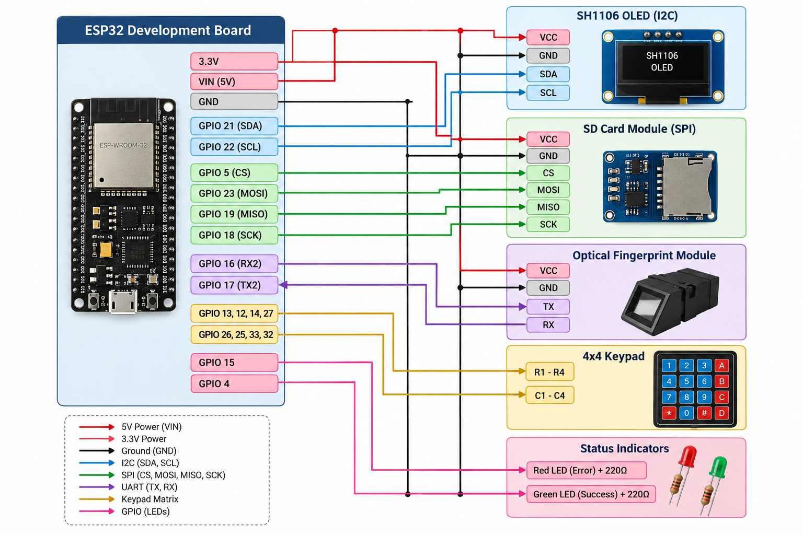

# Smart Fingerprint-Based Attendance and Data Management System

The **Smart Fingerprint-Based Attendance System** is a comprehensive, low-cost, standalone, and automated biometric attendance solution built around an ESP32. It combines biometric authentication, local data storage, accurate time tracking, and wireless data management to seamlessly track student attendance.

The main idea is to identify students using their unique fingerprints and automatically record their attendance along with the exact time. This reduces manual work and prevents repeated or incorrect attendance entries.

## Key Features
- **Biometric Authentication:** Uses a fingerprint scanner for user enrollment and verification.
- **Adaptive Template Retraining:** A companion mobile app automatically analyzes recent successful scans and updates the ESP32's stored template to improve future scan accuracy.
- **OLED Display & LEDs:** Real-time feedback and menu system using an Adafruit SH1106G 128x64 display and Red/Green status LEDs.
- **Keypad Input:** 4x4 matrix keypad to navigate menus and input IDs.
- **SD Card Logging:** Saves fingerprint templates and daily attendance logs locally in CSV format.
- **Web Server:** Connects to Wi-Fi and hosts a local webpage to download attendance CSV files over the local network.
- **BLE Connectivity:** Supports Nordic UART Service (NUS) to list, download, and upload files wirelessly over Bluetooth.
- **NTP Time Sync:** Automatically syncs the time to ensure logs are accurately time-stamped.
- **Cloud Sync:** The mobile app syncs local attendance data to Firebase for centralized access, reporting, and management.

## Hardware Components & Wiring

| Component | Pin / Interface | ESP32 Pin |
|-----------|----------------|-----------|
| **OLED Display** | I2C SDA | GPIO 21 |
| | I2C SCL | GPIO 22 |
| **SD Card Module** | SPI CS | GPIO 5 |
| | SPI MOSI | GPIO 23 |
| | SPI MISO | GPIO 19 |
| | SPI SCK | GPIO 18 |
| **Fingerprint Scanner** | Serial TX | GPIO 16 (RX2) |
| | Serial RX | GPIO 17 (TX2) |
| **4x4 Keypad** | Row 1, 2, 3, 4 | GPIO 13, 12, 14, 27 |
| | Col 1, 2, 3, 4 | GPIO 26, 25, 33, 32 |
| **Bi-Color / Status LEDs**| RED LED | GPIO 15 |
| | GREEN LED | GPIO 4 |

## Software Architecture

The system consists of two main software components:

### 1. ESP32 Firmware (C++)
The firmware manages the hardware peripherals using a state machine architecture:
- **State Management (`loop()`):** The software runs on a state machine (`SystemState`) managing transitions between the Main Menu, Enrollment Mode, Attendance Mode, and Raw Template extraction. Input is continuously monitored from both the 4x4 keypad and the Serial connection.
- **Biometrics & Security (`Adafruit_Fingerprint.h`):** The `getFingerprintEnroll()` function securely captures a fingerprint by requiring two matching scans before generating a mathematical template and saving it to the sensor's non-volatile memory. `checkAttendance()` continuously polls the scanner to find matches in the local database.
- **Data Logging & SD Card (`SD.h`):** When a user is identified, their attendance is logged to a CSV file on the SD card. Newly scanned templates are also logged for adaptive retraining.
- **Wi-Fi & Web Server (`WebServer.h`):** The ESP32 connects to Wi-Fi and hosts a lightweight web server on port 80. The root URL (`/`) serves an HTML page dynamically generated by listing all `.csv` files stored on the SD card, allowing users to download logs over the local network.
- **Bluetooth Low Energy (BLE):** Implements a Nordic UART Service (NUS) profile for wireless communication. Custom Characteristic Callbacks handle chunked commands (`CMD:LIST_FILES`, `CMD:GET_FILE`, `CMD:PUT_FILE`) to securely transfer large payload data (raw hex streams or CSV files) over small MTU packets.
- **Time Synchronization:** Utilizes `time.h` paired with NTP to fetch accurate real-world time over Wi-Fi.

### 2. Companion Mobile Application (Flutter)
A cross-platform mobile application that interfaces with the ESP32 via BLE and Firebase:
- **Device Synchronization:** Connects to "ESP32 Gate" via BLE to fetch scanned templates and attendance logs wirelessly without removing the SD card.
- **Adaptive Retraining Algorithm:** Automatically analyzes recent successful fingerprint scans, compares them byte-by-byte with the original template, and generates an optimized template (medoid). It then uploads this `optimized_templates.csv` back to the ESP32.
- **Data Management & Firebase:** Syncs local attendance data to Firebase Cloud Firestore for centralized access and reporting.
- **User Interface:** Provides an intuitive dashboard for teachers and admins to view student records, manage classes, and interact with the hardware.

## Python Utility
A `read_serial.py` script is included to interface with the ESP32 via serial. It automatically connects and can programmatically request fingerprint templates without needing the Arduino IDE Serial Monitor.

## Setup & Installation

### Firmware Deployment
1. Open the `.ino` file in the Arduino IDE.
2. Ensure you have installed the required libraries: `Adafruit Fingerprint Sensor Library`, `Adafruit SH110X`, `BLEDevice`.
3. Update the Wi-Fi credentials (`ssid` and `password`) in the code.
4. Flash the code to your ESP32.

### Mobile App Deployment
1. Ensure Flutter is installed and configured on your machine.
2. Run `flutter pub get` to install dependencies.
3. Run `flutter build apk --release` to generate the release APK for Android.
4. Install the generated APK on your Android device.

## System Modes / Usage
1. **Enrollment Mode:** Register a new user ID (1-1000) and scan their fingerprint twice to generate a robust template.
2. **Attendance Mode:** Actively scans for fingerprints and logs verified matches to the SD card, triggering the Green LED.
3. **View Raw Template:** Output the raw hex data of a fingerprint template over the Serial Monitor.
4. **Clear Database:** Wipes all saved fingerprints from the sensor and the SD card backup.
5. **Mobile Sync:** Open the Flutter app, connect via Bluetooth, and synchronize records or update optimized templates.
